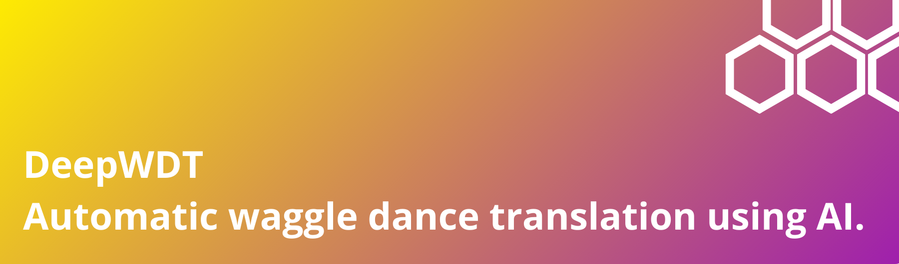

This repository is the official implementation of DeepWDT (Deep Waggle Dance Translator), the most efficient and easy-to-use deep learning framework to detect and decode waggle dances.


## <div align="center">To-do</div>
- [ ] Make a "quick start" google colab of the inference pipeline
- [ ] Add a lightweight version of the deep learning model for quicker inference

## <div align="center">Quick Start</div>

*Google colab version coming soon.*

## <div align="center">Requirements</div>

We recommend you to use Anaconda to create a conda environment:
```Shell
conda create -n deepwdt python=3.10
```

Then, activate the environment:
```Shell
conda activate deepwdt
```

Then, set up your working environment ot our repository:
```Shell
cd path_to_DeepWDT
```

Then install requirements:
```Shell
pip install -r requirements.txt 
```

## <div align="center">Dataset preparation</div>

### Prepare our dataset

As an example, the *Apis dorsata* training dataset can be downloaded at *link coming soon*.  

To prepare it, copy the 'videos' folder and 'annotations.csv' into 'data/bengaluru_01' and launch the following command line:
```Shell
python src/dataset/unpack.py --dataset name_of_the_dataset
```

Feel free to augment the dataset with your own data to improve the model's generalizability.

### Custom data collection advice

<div style="display: flex; justify-content: center; align-items: center; height: 100vh;">
  
  
</div>

As an example, for *Apis mellifera* videos, we recommend to capture videos with the camera pointing directly and straight at the hive frame and with the hive frame being fully inside the video frame. An ibservation hive is the optimal setup.

For technical details, please refer to the inference part.

## <div align="center">Training and Validation</div>

### Training
To retrain the network on the training dataset, you can use the following command line:

```Shell
python main.py --mode train --config src/config/train.yaml
```

If using our training dataset, you can use the config file located at *src/config/train.yaml* in our repository.

We recommend to use MLflow to follow the training metrics. To do this, set "MLFLOW" to "true" in the training config file and launch the MLflow session with:

```Shell
mlflow ui
```

### Validation

To run the validation using specific weights, use the following command line:

```Shell
python main.py --mode eval --configuration src/config/eval.yaml
```

Don't forget to check that the configuration matches the one used when training the weights and to add the path to your trained weights at eval:model:resume in the yaml configuration file.

## <div align="center">Inference</div>

### Infer on a new dataset

```Shell
python main.py --mode infer --configuration src/config/infer.yaml
```

Our training dataset is made of videos taken at 30 fps, with a definition of 1920x1080 and downscaled by 0.5x, which helps to reduce the inference time.

Thus, if you use our weight, we suggest to use 30 fps 1920x1080 videos and a downscale_factor of 0.5.

for each video in the infered dataset.

### Translation to geographic coordinates

In order to properly translate dances to geographic targets, videos should be named as the following template: video-name_x_y_yyyy_mm_dd_hh_mm_ss.

Results of the inference are saved to runs/infer as:

* an annotated video
* a dataframe of the detections for each frame
* a gpkg containing the colony and the translated target positions
* a html map to visualize the translated targets

Currently, the model used to translate durations to distances is from https://doi.org/10.1016/j.anbehav.2019.01.016.

## <div align="center">License</div>

Our software is released under the MIT license.

## <div align="center">Contact</div>

DeepWDT is developed and maintained by Sylvain Grison (sylvain.grison@fieldphenomics.com).
